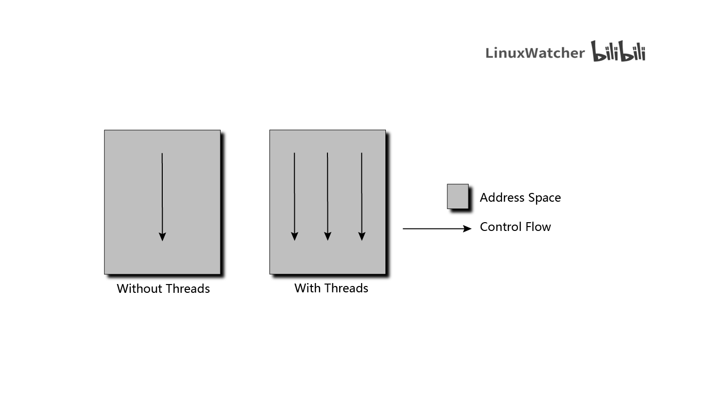
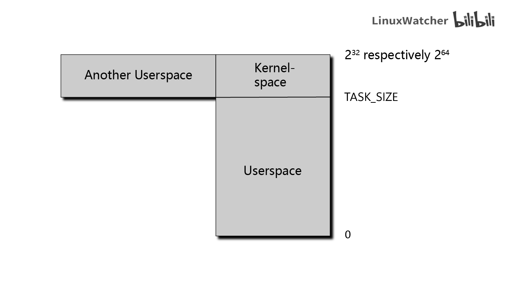
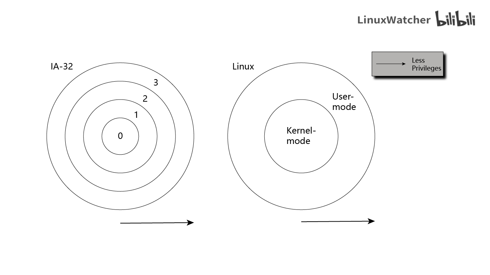

# Professional Linux Kernel Architecture

> Linux Kernel Version: 2.6.24

Unit of size:

|Abbreviation|Value|
|------------|-----|
|KB          |10^3^|
|MB          |10^6^|
|GB          |10^9^|
|KiB         |2^10^|
|MiB         |2^20^|
|GiB         |2^30^|

## Chapter 1

### Task of the Kernel (What is Kernel?)

On a purely technical level, the kernel is an intermediary layer between the hardware and the software. Its purpose is to pass application requests to the hardware and to act as a low-level driver to address the devices and components of the system.

Three point of views:

- *Enhanced machine*: In the view of the application, abstracts the computer on a high level.  
For example, when the kernel addresses a hard disk, it must decide which path to use to copy data from disk to memory, where the data reside, which commands must be sent to the disk via which path, and so on. Applications, on the other hand, need only issue the command that data are to be transferred. How this is done is irrelevant to the application -- the details are abstracted by the kernel, which, for them, represents the lowest level in the hierarchy they know -- and it therefore an enhanced machine. A machine can interpret and execute the command issued.

- *Resource manager*: It is justified when several programs are run concurrently on a system. In this case, the kernel is an instance that shares available resources -- CPU time, disk space, network connections, and so on -- between the various system processes while at the same time ensuring system integrity.

- *Library*: Which provides a range of system-oriented commands. As is generally known, *system calls* are used to send requests to the computer; with the help of the C standard library, these appear to the application programs as normal functions that are invoked in the same way as any other function.

### Kernel Implementation Strategies

Currently, there are two main paradigms on which the implementation of operation systems is based:

1. **Microkernels** -- In these, only the most elementary functions are implemented directly in a central kernel -- the *micro* kernel. All other functions are delegated to autonomous processes that communicate with the central kernel via clearly defined communication interfaces.  
For example, various filesystems, memory management, and so on. (The most elementary level of memory management that controls communication with the system itself is in the microkernel. However, handling on the system call level is implemented in external servers.) Theoretically, this is a very elegant approach because:
    - The individual parts are clearly segregated from each other, and this forces programmers to use "clean" programming techniques.
    - The dynamic extensibility and the ability to swap important components at run time.

However, owing **the additional CPU time needed to support complex communication between the components**, microkernels have not really established themselves in practice although they have been the subject of active and varied research for some time now.

2. **Monolithic Kernels** (Linux adapted strategy, the performance of monolithic kernels is still greater than that of microkernels) -- They are the alternative, traditional concept. Here, the entire code of the kernel -- including all its subsystems such as memory management, filesystems, or device drivers -- is packed into a single file. Each function has access to all other parts of the kernel; this can result in elaborately nested source code if programming is not done with great care.  
However, one major innovation has been introduced. *Modules* with kernel code that can be inserted or removed while the system is up-and-running support the dynamic addition of a whole range of functions to the kernel, thus compensating for some of the disadvantages of monolithic kernels. This is assisted by elaborate means of communication between the kernel and userland that allows for implementing hotplugging and dynamic loading of modules.

### Processes, Task Switching, and Scheduling

*Processes*: Applications, servers, and other programs running under UNIX are traditionally referred to as *processes*. Each process is assigned address space in the *virtual memory* of the CPU. The address spaces of the individual processes are totally independent so that the processes are unaware of each other -- as far as each process is concerned, it has impression of being the only process in the system.

Because Linux is a *multitasking system*, it supports what appears to be concurrent execution of several processes. Since only as many processes as there are CPUs in the system can really run at the same time, the kernel switches (unnoticed by users) between the processes at short intervals to give them the impression of simultaneous processing. Which leads to two problem areas:

1. *Task switching*: The kernel, with the help of the CPU, is responsible for the technical details of task switching. Each individual process must be given the illusion that the CPU is always available. This is achieved by saving all state-dependent elements of the process before CPU resources are withdrawn and the process is placed in an idle state. When the process reactivated, the exact saved state is restored.

2. *Scheduling*: The kernel must also decide how CPU time is shared between the existing processes. Important processes are given a larger share of CPU time, less important process a smaller share.

### UNIX Processes

Linux employs a hierarchical scheme in in which each process depends on a parent process. The kernel starts the `init` program (the System V init) as the first process that is responsible for further initialization actions and display of the login prompt or (in more widespread use today) display of a graphical login interface. `init` (with the `pid` of 1) is therefore the root (parent) process from which all processes originate. It can be examined by issuing `pstree` program.

> #### Why Replace `init` with `systemd`?
>
> `systemd` is System Daemon (with a primary component "system and service manager") named with UNIX convention to add `d` at the end of daemon. Similar to `init`, `systemd` (also with the `pid` of 1) is the parent process of all other processes directly or indirectly and is the first process that starts at boot. Itself is a background process which is designated to start processes in parallel, thus reducing the boot time and computational overhead.
>
> This `init` daemon is now used by modern systems and **starts system services in parallel** which removes unnecessary delays (in comparison to sequential start by System V init) and speed up the initialization process. `systemd` uses Unit Dependencies to define whether a service **wants/requires** other services to run successfully, and Unit Order to define whether a service needs other services to be started **before/after** it (System V init uses run level to start services sequentially). And these services is managed by `systemctl`.

For generating new process from the `init`, UNIX uses two mechanisms:

1. **fork** -- Generates an exact copy of the current process that differs from the parent process only in its PID (process identification). After the system call has been executed, there are two processes in the system, both performing the same actions. The memory contents of the initial process are duplicated -- at least in the view of the program. Linux uses a well-known technique known as *copy on write* that allows it to make the operation much more efficient by deferring the copy operations until either parent or child writes to a page -- read-only accessed can be satisfied from the same page for both.  
A possible scenario for using `fork` is, for example, when a user opens a second browser window. If the corresponding option is selected, the browser executes a `fork` to duplicate its code and then starts the appropriate actions to build a new window in the child process.

2. **exec** -- Loads a new program into an existing content and then executes it. The memory pages reserved by the old program are flushed, and their contents are replaced with new data. The new program then starts executing.

### Threads

Processes are not the only form of program execution supported by the kernel. In addition to *heavy-weight process* (another name for classical UNIX processes), there are also *threads*, sometimes referred to as *light-weight processes*. They have also been around for some time, and essentially, *a process may consist of several threads* that all share the same data and resources but take different paths through the program code.

A process can be seen as an executing program, whereas a thread is a program function or routine running in parallel to the main program. 

For example, when Web browsers need to load several images in parallel. Usually, the browser would have to execute several `fork` and `exec` calls to generate parallel instances; these would then be responsible for loading the images and making data received available to the main program using some kind of communication mechanisms.  
Threads make this situation easier to handle. The browser defines a routine to load images, and the routine is started as a thread with multiple strands (each with different arguments). Because the threads and the main program share same address space, data received automatically reside in the main program. There is therefore no need for any communication effort whatsoever, except to **prevent the threads from stepping onto their feet mutually by accessing identical memory locations**, for instance.



Linux provides the `clone` method to generate threads. This works in similar way to `fork` but enables a precise check to be made of which resources are shared with the parent process and which are generated independently for the thread. This fine-grained distribution of resources extends the classical thread concept and allows for a more or less continuous transition between thread and processes.

### Namespaces

Namespace allow different processes to have different views of the system.

Traditionally, Linux (and UNIX in general) use numerous global quantities, for instance, process identifiers: Every process in the system is equipped with a unique identifier (ID), and this ID can be employed by users (or other processes) to refer to the process -- by sending it a signal, for instance.  
With namespaces, formerly global resources are grouped differently: Every namespace can contain a specific set of PIDs, or can provide different views of the filesystem, where mounts in one namespace do not propagate into different namespaces.

Namespaces are beneficial for hosting providers: Instead of setting up one physical machine per customer, they can instead use *containers* implemented with namespaces to create multiple views of the system where each seems to be a complete Linux installation from within the container and does not interact with other containers: They are separated and segregated from each other. Every instance looks like a single machine running Linux, but in fact, many such instances can operate simultaneously on a physical machine. This helps use resources more effectively. In contrast to full virtualization solutions like KVM, only a single kernel needs to run on the machine and is responsible to manage all containers.

### Address Space and Privilege Levels

Memory areas are addressed by means of pointers, the word length of the CPU determines the maximum size of the address space that can be managed. On 32-bit systems such as IA-32, PPC, and m68k, these are 2^32^ = 4 GiB, whereas on more modern 64-bit processors such as Alpha, Sparc64, IA-64, and AMD64, 2^64^ bytes can be managed.

The maximal size of the address space is **not** related to how much physical RAM is actually available, and therefore it is known as the *virtual address space*. One reason of this terminology is that every process in the system has the impression that it would solely live in this address space, and other processes are not present from their point of view. Applications do not need to care about other applications and can work as if they would run as the only process on the computer.

Linux divides virtual address space into two parts known as *kernel space* and *userspace*.  
Every user process in the system has its own virtual address range that extends from 0 to `TASK_SIZE`. The area above (from `TASK_SIZE` to 2^32^ or 2^64^) is reserved exclusively for the kernel -- and **may not be accessed by user processes**. `TASK_SIZE` is an architecture-specific constant.



For example, in IA-32 systems, the address space is divided at 3 GiB so that the virtual address space for each process is 3 GiB; 1 GiB is available to the kernel because the total size of the virtual address space is 4 GiB.

The division **does not depend on how much RAM is available**. As a result of address space virtualization, each user process thinks it has 3 GiB of memory.

- The userspaces of individual system processes are totally separate from each other.
- The kernel space at the top end of the virtual address space is always the same, regardless of the process currently executing.

> Notice that the picture can be more complicated on 64-bit machines because these tend to use less than 64 bits to actually manage their huge principal virtual address space. Instead of 64 bits, they employ a smaller number, for instance, 42 or 47 bits. Because of this, the effectively addressable portion of the address space is smaller than the principal size. However, it is still larger than the amount of RAM that will ever be present in the machine, and is therefore completely sufficient. As an advantage, the CPU can save some effort because less bits are required to manage the effective address space than are required to address the complete virtual address space. Thus the virtual address space will contain holes that are not addressable in principle in such cases.

#### Privilege Levels

All modern CPUs offer several privilege levels in which processes can reside. There are various prohibitions in each level including, for example, execution of certain assembly language instructions or access to specific parts of virtual address space.  
The IA-32 architecture uses a system of four privilege levels that can be visualized as rings. The inner rings are able to access more functions, the outer rings less. And the Intel variant distinguishes four different levels.



Linux uses only two different modes: kernel mode and user mode. The key difference between the two is that access to the memory area above `TASK_SIZE` (the kernel space) is forbidden in user mode. User processes are not able to manipulate or read the data in kernel space. Neither can they execute code stored there.

The switch from user to kernel mode is made by means of special transitions known as *system calls*: these are executed differently depending on the system. If a normal process wants to carry out any kind of action affecting the entire system (e.g., manipulating I/O devices), it can do this only by:

1. *issuing a request* to the kernel with the help of a system call.
2. The kernel checks whether the process is *permitted* to perform the desired action.
3. The kernel performs the action on its behalf.
4. A return is made from kernel to user mode.

> Besides executing code on behalf of a user program, the kernel can also be activated by asynchronous hardware interrupts, and is then said run in *interrupt context*. The main difference to running in process context is that the userspace portion of the virtual address space must not be accessed. Because interrupts occur at random times, a random userland process is active when an interrupt occurs, and since the interrupt will most likely be unconnected with the cause of the interrupt, the kernel has no business with the contents of the current userspace. When operating in interrupt context, the kernel must be more cautious than normal; for instance, it must not go to sleep.

> Besides normal processes, there can also be *kernel threads* running on the system. Kernel threads are also not associated with any particular userspace process, so they also have no business dealing with the user portion of the address space. In many other respects, kernel threads behave much more like regular userland applications. In contrast to a kernel operating in interrupt context, they may go to sleep, and they are also tracked by the scheduler like every regular process in the system. The kernel uses them for various purposes that range from data synchronization of RAM and block devices to helping the scheduler distribute processes among CPUs.

> Processes can be viewed by `ps fax`. On multiprocessor systems, many threads are started on a per-CPU basis and are restricted to run on only one specific processor. This is represented by a slash and the number of the CPU that are appended to the name of the kernel thread. This can be observed by issuing `ps -o pid,psr,cmd fax`. (Kernel threads are in square brackets and only these threads can be restricted on specific CPU) (`psr` (from Solaris) and `cpuid` (from NetBSD and OpenBSD) denotes the processor ID the thread is currently on)

#### Virtual and Physical Address Spaces

> In most cases, a single virtual address space is bigger than the physical RAM available to the system. And situation does not improve when each process has its own virtual address space. The kernel and CPU must therefore consider how the physical memory actually available can be mapped onto virtual address areas.
> 
> The preferred method is to use page tables to allocate *virtual* address (the combined user and kernel space of a process) to *physical* address (the RAM actually available). 

The virtual address spaces of both processes are divided into portions of equal size by the kernel. These portions are known as *pages*, Physical memory is also divided into pages of the same size.

Physical pages are often called *page frames*. In contrast, the term *page* is reserved for pages in virtual address space.

Not all pages of the virtual address spaces are linked with a page frame. This may because:
- Pages are not used.
- Data have not been loaded into memory (not yet needed).
- The page has been swapped out onto hard disk and will be swapped back in when needed.

> The two equivalent terms to address the applications that run on behalf of the user.
> - *userland*: Denote applications. The nomenclature typically preferred by the BSD community for all things that do not belong to the kernel.
> - *userspace*: Denote applications, also the portion of the virtual address space in which they are executed, in contrast to kernel space.

### Page Tables

Date structures known as *page tables* are used to **map virtual address space to physical address space**. As most areas of virtual address spaces are not used and are therefore not associated with page frames, a far less memory-intensive model that fulfills the same purpose can be used: **Multilevel Paging**. (which implies an array containing entries for each page in virtual space is impractical)

To reduce the size of page tables and to allow unneeded areas to be ignored, the architectures split each virtual address into multiple parts. Linux adopts four levels of indirection, and this leads to *four-level page table*:
1. *PGD*: Page Global Directory.
2. *PUD*: Page Upper Directory.
3. *PMD*: Page Middler Directory.
4. *PTE*: Page Table Entry.
5. *Offset*:

A particular feature of page tables is that no page middle tables or page tables need be created for areas of virtual address space that are not needed. This saves a great deal of RAM as compared to the single-array method.

Downside of multilevel paging: Each time memory is accessed, it is necessary to run through the entire chain to obtain the physical address from the virtual address. CPUs try to speed up this process in two ways:
1. A special part of the CPU known as a *memory management unit (MMU)* is optimized to perform referencing operations.
2. The addresses that occur most frequently in address translation are held in a fast CPU cache called a *Translation Lookaside Buffer (TLB)*. Translation is accelerated because the address data in the cache are immediately available without needing to access the page tables and therefore the RAM.  
> While caches are operated transparently on many architectures, some require special attention from the kernel, which especially implies that their contents must be invalidated whenever the contents of the page table have been changed. Corresponding calls must be present in every part of the kernel that manipulates page tables. If the kernel is compiled for an architecture that does not require such operations, it automatically ensures that the calls are represented by do-nothing operations.

> #### Interaction with the CPU
> 
> The IA-32 architecture uses a two-level-only method to map virtual addresses to physical addresses. The size of the address space in 64-bit architectures (Alpha, Sparc64, IA-64, etc.) mandates a three-level or four-level method, and the architecture-*independent* part of the kernel always assumes a four-level page table.
> 
> The architecture-*dependent* code of the kernel for two- and three-level CPUs must therefore emulate the missing levels by dummy page tables. Consequently, the remaining memory management code can be implemented independently of the CPU used.

### Memory Mappings

*Memory mappings* are an important means of abstraction. They are used at many points in the kernel and are also available to user applications. Mapping is the method by which data from an arbitrary source are transferred into the virtual address space of the process. The address space areas in which mapping takes place can be processed using normal methods in the same way as regular memory. And, any changes made are transferred automatically to the original data source. This makes it possible to use identical functions to process totally different thing.  
For example, the contents of a file can be mapped into memory. A process then need only read the contents of memory to access the contents of the file, or write changes to memory in order to modify the contents of the file. The kernel automatically ensures that any changes made are implemented in the file.

Mappings are also used directly in the kernel when implementing device drivers. The input and output areas of peripheral devices can be mapped into virtual address space; reads and writes to these ares are then redirected to the devices by the system, thus greatly simplifying driver implementation.

### Allocation of Physical Memory

> When RAM gets allocated, the kernel must keep track of which pages have already been allocated and which are still free in order to prevent two processes from using the same areas in RAM. Because memory allocation and release are very frequent tasks, the kernel must also ensure that they are completed as quickly as possible. **The kernel can allocated only whole page frames**. Dividing memory into smaller portions is delegated to the standard library in userspace. This library splits the page frames received from the kernel into smaller areas and allocates memory to the processes.

#### The Buddy System

Numerous allocation requests in the kernel must be fulfilled by a continuous range of pages. To quickly detect where in memory such ranges are still available, the kernel employs an old, but proven technique: The Buddy System.

Free memory blocks in the system are always grouped as two buddies. The buddies can be allocated independently of each other; if, however, both remain unused at the same time, the kernel merges them into a larger pair that serves as a buddy on the next level.

When memory is returned by the application, the kernel can easily see by reference to the addresses whether a buddy pair is reunited and can then merge it into a large unit that is put back into the buddy list (exactly the reverse of the splitting process). This increases the likelihood that larger memory blocks are available.

> When systems run for longer periods (it is not unusual for servers to run for several weeks or even months, and many desktop systems also tend to reach long uptime), a memory management problem known as *fragmentation* occurs. The frequent allocation and release of page frames may lead to a situation in which several page frames are free in the system but they are scattered throughout physical address space (in other words, there are no larger *contiguous* blocks of page frames, as would be desirable for performance reasons). This effect is reduced to some extent by the buddy system but not completely eliminated. Single reserved pages that sit in the middle of an otherwise large continuous free range can eliminate coalescing of this range very effectively.

#### The Slab Cache

> Often the kernel itself needs memory blocks much smaller than a whole page frame. Because it cannot use the functions of the standard library, it must define its own, additional layer of memory management that builds on the buddy system and divides the pages supplied by the buddy system into smaller portions. The method used not only performs allocation but also implements a generic cache for frequently used small objects.

This cache is known as *Slab Cache*. It can be used to allocate memory in two ways:
1. For frequently used objects, the kernel defines its own cache that contains only instances of the desired type. Each time one of the objects is required, it can be quickly removed from the cache (and returned there after use); the slab cache automatically takes care of interaction with the buddy system and requests new page frames when the existing caches are full.
2. For the general allocation of smaller memory blocks, the kernel defines a set of slab caches for various object sizes that it can access using the same functions with which we are familiar from userspace programming; a prefixed `k` indicates that these functions are associated with the kernel: `kmalloc` and `kfree`.

#### Swapping and Page Reclaim

*Swapping* enables available RAM to be enlarged virtually by using disk space as extended memory. Infrequently used pages can be written to hard disk when the kernel requires more RAM. Once the data are actually needed, the kernel swaps them back into memory. The concept of *page faults* is used to make this operation transparent to applications. Swapped-out pages are identified by a special entry in the page table. When a process attempts to access a page of this kind, the CPU initiates a page fault that is intercepted by the kernel. The kernel then has the opportunity to swap the data on disk into RAM. The user process then resumes. Because it is unaware of the page fault, swapping in and out of the page is totally invisible to the process.

*Page reclaim* is used to synchronize modified mappings with underlying block devices. For this reason, it is sometimes referred to simply as *writing back data*. Once data have been flushed, the page frame can be used by the kernel for other purposes (as with swapping). After all, the kernel data structures contain all the information needed to find the corresponding data on the hard disk when they are again required.

### Timing

The kernel must be capable of measuring time and time differences at various points (when scheduling processes and etc.). *Jiffies* are one possible time base. A global variable named *jiffies_64* and its 32-bit counterpart *jiffies* are incremented periodically at constant time intervals. The various timer mechanisms of the underlying architectures are used to perform these updates (each computer architecture provides some means of executing periodic actions, usually in the form of timer interrupts).

Depending on architecture, *jiffies* is incremented with a frequency determined by the central constant `HZ` of the kernel. This is usually on the range between 1,000 and 100; in other words, the value of `jiffies` is incremented between 1,000 and 100 times per second.

Timing based on *jiffies* is relatively coarse-grained because 1,000 Hz is not an excessively large frequency nowadays. With *high-resolution timers*, the kernel provides additional means that allows for keeping time in the regime of nanosecond precision and resolution, depending on the capabilities of the underlying hardware.

It is possible to make the periodic tick *dynamic*. When there is little to do and no need for frequent periodic actions, it does not make sense to periodically generate timer interrupts that prevent the processor from powering down into deep sleep states. This is helpful in systems where power is scarce, for instance, laptops and embedded systems.

### System Calls

*System calls* are classical method of enabling user processes to interact with the kernel. The POSIX standard defines a number of system calls and their effect as implemented on all POSIX-compliant systems including Linux. Traditional system calls are grouped into various categories:
- **Process Management**: Creating new tasks, querying information, debugging.
- **Signals**: Sending signal, timers, handling mechanisms.
- **Files**: Creating, opening, and closing files, reading from and writing to files, querying information and status.
- **Directories and Filesystem**: Creating, deleting, and renaming directories, querying information, links, changing directories.
- **Protection Mechanisms**: Reading and changing UIDs/GIDs, and namespace handling.
- **Timer Functions**: Timer functions and statistical information.

These functions can not be implemented in a normal user library because spacial protection mechanisms are needed to ensure that system stability and/or security are not endangered, and many calls are reliant on kernel-internal structures or functions to yield desired data or result.

When a system call is issued, the processor must change the privilege level and switch from user mode to system mode. There is no standardized way of doing this in Linux as each hardware platform offers specific mechanisms. In some cases, different approaches are implemented on the same architecture but depend on processor type. What all variants have in common is that system calls are the only way of enabling user processes to switch in their own incentive from user mode to kernel mode in order to delegate system-critical tasks.

### Device Drivers, Block and Character Devices

> The role of device drivers is to communicate with I/O devices attached to the system; for example, hard disks, floppies, interfaces, sound cards, and so on. In accordance with the classical UNIX maxim that "*everything is a file*", access is performed using device files that usually reside in the `/dev` directory and can be processed by programs in the same way as regular files. The task of a device driver is to support application communication via device files; in other words, to enable data to be read from and written to a device in a suitable way.

Peripheral devices belong to one of the following two groups:

1. **Character Devices**: Deliver a continuous stream of data that applications read sequentially; generally, random access in not possible. Instead, such devices allow data to be read and written byte-by-byte or character-by-character. Modems are classical examples of character devices.

2. **Block Devices**: Allow applications to address their data randomly and to freely select the position at which they want to read data. Typical block devices are hard disks because applications can address any position on the disk from which to read data. Also, data can be read or written only in multiples of block units (usually 512 bytes); character-based addressing, as in character devices, in not possible.

> Programming drivers for block devices is much more complicated than for character devices because extensive caching mechanisms are used to boost system performance.

### Networks

Network cards are also controlled by device drivers but assume a special status in the kernel because they cannot be addressed using device files. This is because data are packed into various protocol layers during network communication. When data are received, the layers must be disassembled and analyzed by the kernel before the payload data are passed to the application. When the data are sent, the kernel must first pack the data into the various protocol layers to dispatch.

However, to support work with network connections via the file interface (in the view of applications), Linux uses *sockets* from the BSD world; these act as agents between the application, file interface, and network implementation of the kernel.

### Filesystems

Linux systems are made up of many thousands or even millions of files whose data are stored on hard disks or other block devices (e.g. ZIP drives, floppies, CD-ROMs, etc.). Hierarchical filesystems are used; these allow stored data to be organized into directory structures and also have the job of linking other meta-information (owners, access rights, etc.) with the actual data. Many different filesystem approaches are supported by Linux: the standard filesystems Ext2 and Ext3, ReiserFS, XFS, VFAT (for reasons of compatibility with DOS), and countless more. The concepts on which they build differ drastically in part.

Ext2 is based on *inodes*, that is, it makes a separate management structure known as an *inode* available on disk for each file. The inode contains not only all meta-information but also pointers to the associated data blocks. Hierarchical structures are set up by representing directories as regular files whose data section includes pointers to the inodes of all files contained in the directory. In contrast, ReiserFS makes extensive use of tree structures to deliver the same functionality.

### Modules and Hotplugging

> Modules are used to dynamically add functionality to the kernel at run time: device drivers, filesystems, network protocols, practically any subsystem (with the exception of basic functions, such as memory management, which are always needed) of the kernel can be modularized. This removes one of the significant disadvantages of monolithic kernels as compared with microkernel variants.

Modules can also be unloaded from the kernel at run time, a useful aspect when developing new kernel components.

Basically, modules are simply normal programs that execute in kernel space rather than in userspace. They must also provide certain sections that are executed when the module is initialized (and terminated) in order to register and de-register the module functions with the kernel.

Modules are an essential requisite to support for *hotplugging*. Some buses (e.g., USB and FireWire) allow devices to be connected while the system is running without requiring a system reboot. When the system detects a new device, the requisite driver can be automatically added to the kernel by loading the corresponding module.

Modules also enable kernels to be built to support all kinds of devices that the kernel can address without unnecessarily bloating kernel size. Once attached hardware has been detected, only the requisite modules are loaded, and the kernel remains free of superfluous drivers.

### Caching

The kernel uses *caches* to improve system performance. Data read from slow block devices are held in RAM for a while, even if they are no longer needed at the time. When an application next accesses the data, they can be read from fast RAM, thus bypassing the slow block device. Because the kernel implements access to block devices by means of page memory mappings, caches are also organized into pages, that is, whole pages are cached, thus giving rise to the name *page cache*.

> The far less important *buffer cache* is used to cache data that are not organized into pages. On traditional UNIX systems, the buffer cache serves as the main system cache, and the same approach was used by Linux a long, long time ago. By now, the buffer cache has mostly been superseded by the page cache.

### List Handling

The kernel is required to handle *doubly linked lists*. Standard lists as provided by the kernel can be used to link data structures of any type with each other, thus it is explicitly not *type-safe*. The data structures to be listed must contain an element of the `list_head` type; this accommodates the forward and back pointers. If a data structure is to be organized in several lists (which is normal), then several `list_head` elements are needed.

In `<list.h>`:
```C
struct list_head {
    struct list_head *next, *prev;
}
```
This element could be placed in a data structure as follow:
```C
struct task_struct {
...
    struct list_head run_list;
...
};
```
The starting point for linked lists is again an instance of `list_head` that is usually declared and initialized by the `LIST_HEAD(list_name)` macro.

`struct list_head` is called a *list element* when it is held in a data structure. An element that serves as the starting point for a list is called *list_head*.

`list_entry` must be used to find a list element; at first glance, its call syntax apperas to be quite complicated: `list_entry(ptr, tyep, member)`. `ptr` is a pointer to the `list_head` instance of the data structure, `type` is its type, and `member` is the element name used for the list element. The following sample call would be needed to find a `task_struct` instance of a list:
```C
struct task_struct = list_entry(ptr, struct task_struct, run_list)
```
Explicit type specification is required because list implementation is not *type-safe*. The list element must be specified to find the correct element if there are data structures that are included in several lists.

### Object Management and Reference Counting

The generic kernel object mechanism can be used to perform the following operations on objects:
- Reference counting
- Management of lists (sets) of objects
- Locking of sets
- Exporting object properties into userspace

#### Generic Kernel Object

`<kobject.h>`
```C
struct kobject {
    const char          * k_name;
    struct kref         kref;
    struct list_head    entry;
    struct kobject      * parent;
    struct kset         * set;
    struct kobj_type    * ktype;
    struct sysfs_dirent * sd;
}
```
The meanings of the individual elements of `struct kobject` are as follows:
- `k_name` is a text name exported to userspace using `sysfs`. Sysfs is a virtual filesystem that allows for exporting various properties of the system into userspace. Likewise `sd` supports this connection.
- `kref` holds the general type `strcut kref` designed to simplify reference management.
- `entry` is a standard list element used to group several `kobjects` in a list (known as a set in this case).
- `kset` is required when an object is grouped with other objects in a set.
- `parent` is a pointer to the parent element and enables a hierarchical structure to be established between `kobject`s.
- `ktype` provides more detailed information on the data structure in which a `kobject` is embedded. Of greatest importance is the destructor function that returns the resources of the embedding data structure.

> It is essential that `kobject`s are not linked with other data structures by means of pointers but are directly embedded. Managing the kernel object itself amounts to managing the whole containing object this way. Since `struct kobject` is embedded into many data structures of the kernel, the developers take care to keep it small. Adding a single new element to this data structure results in a size increase of many other data structures. Embedded kernel objects look as follows:

```C
struct sample {
...
    struct kobject kobj;
...
};
```

The layout of the `kref` structure used to manage references is as follows:

`<kref.h>`
```C
struct kref {
    atomic_t refcount;
};
```
`refcount` is an atomic data type to specify the number of positions in the kernel at which an object is currently being used. When the counter reaches 0, the object is no longer needed and can therefore be removed from memory.

"Atomic" means in this context that incrementing and decrementing the variable is also safe on multiprocessor systems, where more than one code path can access an object at the same time.

Encapsulation of the single value in a structure was chosen to prevent direct manipulation of the value. `kref_init` must always be used for initialization. If an object is in use, `kref_get` must be invoked beforehand to increment the reference counter. `kref_put` decrements the counter when the object is no longer used.

> Although manipulating the reference counter this way against concurrency issues, this does not imply that the surrounding data structure is safe against concurrent access.

#### Sets of Objects

In many cases, it is necessary to group different kernel objects into a set (e.g., the set of all character devices or the set of all PCI-based devices). The data structure provided for this purpose is defined as follows:


`<kobject.h>`
```C
struct kset {
    struct kobj_type        * ktype;
    struct list_head        list;
...
    struct kobject          kobj;
    struct kset_uevent_ops  * uevent_ops;
}
```
The `kset` serves as the first example for the use of kernel objects. Since the management structure for sets is nothing other than a kernel object, it can be managed via the previously discussed `struct kobj`. Indeed, an instance is embedded via `kobj`. It has nothing to do with the `kobject`s collected in the set, but only serves to manage the properties of the `kset` object itself.

The other members:
- `ktype` points to a further object that generalizes the behavior of the `kset`.
- `list` is used to build a list of all kernel objects that are a member of the set.
- `uevent_ops` provides several function pointers to methods that relay information about the state of the set to userland. This mechanism is used by the core of the driver, for instance, to format messages that inform about the addition of new devices.

`<kobject.h>`
```C
struct kobj_type {
...
    struct sysfs_ops        * sysfs_ops;
    struct attribute        ** default_attrs;
}
```
Note that a `kobj_type` is not used to collect various kernel objects (this is already managed by `kset`s). Instead, it provides an interface to the sysfs filesystem. If multiple objects export similar information via the filesystem, then this can be simplified by using ktype to provide the required methods.

### Type Definitions

The kernel uses `typedef` to define various data types in order to make itself independent of architecture specific features because of the different bit lengths for standard data types on individual processors. `typedef`d variables must not be accessed directly, but only via auxiliary functions. This ensures that they are properly manipulated, although the type definition is transparent to the user.

### Byte Order

To represent numbers, modern computers use either the *big endian* or *little endian* format. The format indicates how multibyte data types are stored. With big endian ordering, the most significant byte is stored at the lowest address and the significance of the bytes decreases as the addresses increase. With little endian ordering, the least significant byte is stored at the lowest address and the significance of the bytes increases as the addresses increase.

> Intel uses little endian.

### Per-CPU Variables

A particularity that does not occur in normal userspace programming is per-CPU variables. They are declared with `DEFINE_PER_CPU(name, type)`, where `name` is the variable name and `type` is the data type. On single-processor systems, this is not different from regular variable declaration. On SMP systems with several CPUs, an instance of the variable is created for each CPU. The instance for a particular CPU is selected with `get_cpu(name, cpu)`, where `smp_processor_id()`, which returns the identifier of the active processor, is usually used as the argument for `cpu`.

Employing per-CPU variables has the advantage that the data required are more likely to be present in the cache of a processor and can therefore be accessed faster. This concept also skirts round several communication problems that would arise when using variables that can be accessed by all CPUs of a multiprocessor system.

### Conclusion

It must be taken into account that many architectures on which the kernel runs do not support **unaligned memory access** without further ado. This also affects portability of data structures across architectures because of padding that is inserted by the compiler.

All kernel code must be protected against concurrency. Owing to he support of multiprocessor machines, Linux kernel code must be both **re-entrant** and **thread-safe**. That is, routines must allow being executed simultaneously, and data must be protected against parallel access.
